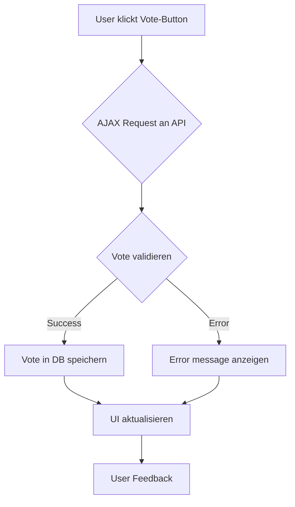

# Like/Dislike-System für Essays und Notizen

## Architektur-Übersicht

### 1. Datenbank-Struktur
```sql
CREATE TABLE wp_hp_votes (
    vote_id BIGINT UNSIGNED AUTO_INCREMENT PRIMARY KEY,
    post_id BIGINT UNSIGNED NOT NULL,
    user_id BIGINT UNSIGNED DEFAULT NULL,
    user_ip VARCHAR(45) NOT NULL,
    vote_type ENUM('like', 'dislike') NOT NULL,
    vote_date DATETIME DEFAULT CURRENT_TIMESTAMP,
    UNIQUE KEY unique_vote (post_id, user_id, user_ip)
);
```

### 2. Backend-Module

#### Vote-Management (inc/votes.php)
- [`hp_register_vote()`](inc/votes.php) - Vote verarbeiten
- [`hp_get_vote_counts()`](inc/votes.php) - Vote-Zahlen abrufen
- [`hp_get_user_vote()`](inc/votes.php) - User-Vote status prüfen

#### REST-API (inc/votes-api.php)
- `POST /wp-json/hp/v1/vote` - Vote submit
- `GET /wp-json/hp/v1/votes/{post_id}` - Vote stats abrufen

### 3. Frontend-Komponenten

#### JavaScript (assets/js/votes.js)
- AJAX-Handler für Vote-Operationen
- UI-Update nach erfolgreichem Vote
- Error-Handling und User-Feedback

#### CSS (assets/css/votes.css)
- Styling für Vote-Buttons
- Animationen für interaktives Feedback
- Responsive Design

### 4. Template-Integration

#### Single Templates
- [`single-essay.php`](single-essay.php) - Vote-Buttons unter Content
- [`single-note.php`](single-note.php) - Vote-Buttons im Footer

#### Archive Templates
- [`template-parts/content-essay.php`](template-parts/content-essay.php) - Kompakte Vote-Anzeige
- [`template-parts/content-note.php`](template-parts/content-note.php) - Kompakte Vote-Anzeige

## Sicherheitsmaßnahmen

- Rate Limiting (max 1 Vote/Post pro Stunde)
- IP-based und User-based Duplikat-Prüfung
- Nonce-Validation für AJAX Requests
- Input Sanitization

## Workflow



## Technische Spezifikationen

- **Post Types**: essay, note
- **Storage**: Custom DB Table
- **API**: WordPress REST API
- **Frontend**: Vanilla JavaScript + CSS
- **Caching**: Transient API für Vote-Counts
- **Compatibility**: WordPress 6.0+

## Next Steps

1. Datenbank-Tabelle erstellen
2. Backend-Funktionen implementieren
3. REST-API Endpoints registrieren
4. Frontend-JavaScript entwickeln
5. Templates erweitern
6. Styling hinzufügen
7. Testing durchführen