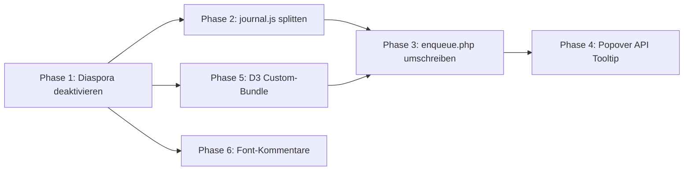

# Theme-Optimierung 2026 — Architekturplan

> **Erstellt:** 2026-04-02  
> **Basis:** Gemini-Analyse + Code-Audit  
> **Scope:** Performance, Code-Splitting, native Web-APIs  
> **Diaspora-Seite:** wird deaktiviert (Dateien bleiben im Repo)

---

## Umsetzungsstand (Stand: 2026-05-12)

| Phase | Status | Beleg |
|-------|--------|-------|
| 1. Diaspora-Assets entkoppeln | **umgesetzt** | `page-diaspora-architektur.php:33–60` Enqueue-Block auskommentiert |
| 2. journal.js splitten | **umgesetzt** | `nav.js`, `journal-single.js`, `glossar-tooltip.js` vorhanden |
| 3. enqueue.php umschreiben | **umgesetzt** | Bedingtes Laden in `inc/enqueue.php:35–86` |
| 4. Popover API Migration | **umgesetzt** | `glossar-tooltip.js` nutzt `showPopover()` / `:popover-open` |
| 5. D3 Custom-Bundle | **umgesetzt** | `d3-custom.min.js` aktiv über `inc/graph-api.php:367–377` |
| 6. Font-Kommentare | **offen** | TODO-Block in `diaspora-scroll.css:18–43` (niedrige Prio) |

**Offene Restaufgaben:**
- Phase 6: Doku-Kommentar zu fehlenden Outfit/Figtree-Fonts (rein kosmetisch, Seite deaktiviert).
- Cleanup-Entscheidung: `assets/js/journal.js` (19 KB) und `assets/js/d3.min.js` (279,7 KB) werden nicht mehr geladen; laut Plan absichtlich als Backup im Repo belassen.
- Smoke-Test-Checkliste (siehe Ende dieses Dokuments) — manuelle Browser-Verifikation.

---

## Ist-Zustand

```
Datei                          Größe      Geladen auf
─────────────────────────────  ─────────  ─────────────────────
assets/js/journal.js           567 Zeilen ALLE Seiten (global)
assets/js/d3.min.js            ~279.7 KB  Wissensgraph + Diaspora
assets/js/graph.js             872 Zeilen Wissensgraph
assets/js/diaspora-scroll.js   841 Zeilen Diaspora (wird deaktiviert)
assets/css/diaspora-scroll.css 2987 Zeil. Diaspora (wird deaktiviert)
```

### Probleme

| # | Problem | Impact |
|---|---------|--------|
| 1 | `journal.js` lädt 567 Zeilen auf ALLEN Seiten — obwohl TOC, Footnotes, Share nur auf Singles gebraucht werden | Unnötiger JS-Overhead auf ~80% der Seitenaufrufe |
| 2 | D3.js voll gebündelt mit 279.7 KB — nur 6 Module werden tatsächlich genutzt | Performance-Budget auf der Wissensgraph-Seite gesprengt |
| 3 | Glossar-Tooltips sind ~120 Zeilen Custom-JS — native Popover API kann das ersetzen | Vermeidbare Komplexität, schlechtere A11y |
| 4 | Diaspora-Assets werden bei aktiver Seite geladen — Seite wird deaktiviert | Tot-Code im Ladepfad |

---

## Soll-Architektur

```mermaid
graph TD
    subgraph Global - alle Seiten
        A[nav.js ~160 Zeilen]
    end

    subgraph Singles - essay, note, post
        B[journal-single.js ~260 Zeilen]
    end

    subgraph Bedingt - wo Glossar-Terms existieren
        C[glossar-tooltip.js ~120 Zeilen - Popover API]
    end

    subgraph Wissensgraph-Seite
        D[d3-custom.min.js ~80 KB]
        E[graph.js 872 Zeilen]
        D --> E
    end

    subgraph Deaktiviert - Dateien bleiben
        F[diaspora-scroll.js]
        G[diaspora-scroll.css]
        H[d3.min.js - Alt, durch Custom-Bundle ersetzt]
    end
```

---

## Phase 1: Diaspora-Assets vom Laden entkoppeln

**Ziel:** Sicherstellen, dass keine Diaspora-Assets geladen werden, selbst wenn die Seite versehentlich aktiv ist.

**Dateien:**
- [`page-diaspora-architektur.php`](../page-diaspora-architektur.php:31) — Enqueue-Block (Zeile 31–56)

**Aktion:**
1. Den `add_action( 'wp_enqueue_scripts', ... )` Block in `page-diaspora-architektur.php` auskommentieren oder mit einem `return;` am Anfang der Closure versehen
2. Einen Kommentar hinzufügen: `// DEAKTIVIERT 2026-04 — Assets werden nicht mehr geladen`
3. Die Dateien `diaspora-scroll.css`, `diaspora-scroll.js` und `d3.min.js` verbleiben im Repo (kein Löschen)

---

## Phase 2: journal.js in 3 Module splitten

**Ziel:** JS-Payload pro Seitenaufruf um ~70% reduzieren auf Nicht-Single-Seiten.

### Aktueller Aufbau von journal.js (567 Zeilen)

| IIFE | Funktion | Benötigt auf | → Neue Datei |
|------|----------|--------------|--------------|
| 1 | TOC + Active Tracking | Singles | `journal-single.js` |
| 2 | Reading Progress Bar | Singles | `journal-single.js` |
| 3 | Footnote Smooth Scroll | Singles | `journal-single.js` |
| 4 | Share — Link kopieren | Singles | `journal-single.js` |
| 5 | Mobile Navigation Hamburger | Global | `nav.js` |
| 6 | Navigation Search Toggle | Global | `nav.js` |
| 7 | Header Scroll State | Global | `nav.js` |
| 8 | Glossar Tooltip | Bedingt | `glossar-tooltip.js` |

### Neue Dateien

```
assets/js/nav.js              ~160 Zeilen  — IIFE 5, 6, 7
assets/js/journal-single.js   ~260 Zeilen  — IIFE 1, 2, 3, 4
assets/js/glossar-tooltip.js   ~120 Zeilen  — IIFE 8 (migriert auf Popover API)
```

**Aktion:**
1. `nav.js` erstellen — enthält Mobile Nav, Search Toggle, Header Scroll State
2. `journal-single.js` erstellen — enthält TOC, Reading Progress, Footnotes, Share
3. `glossar-tooltip.js` erstellen — Tooltip-Logik (zunächst 1:1 aus journal.js extrahiert, Migration auf Popover API in Phase 4)
4. Originale `journal.js` beibehalten als Referenz, aber nicht mehr laden (umbenennen zu `journal.js.bak` oder Kommentar)

---

## Phase 3: enqueue.php umschreiben

**Ziel:** Bedingtes Laden der neuen Module.

**Datei:** [`inc/enqueue.php`](../inc/enqueue.php:33) — Funktion `hp_journal_enqueue_styles()`

### Neue Enqueue-Logik

```php
function hp_journal_enqueue_assets(): void {
    $v = wp_get_theme()->get( 'Version' );
    $uri = get_stylesheet_directory_uri();

    // 1. Global: Navigation JS (alle Seiten)
    wp_enqueue_script( 'hp-nav-js', $uri . '/assets/js/nav.js', [], $v, true );

    // 2. Singles: TOC, Progress, Footnotes, Share
    if ( is_singular( ['essay', 'note', 'post'] ) ) {
        wp_enqueue_script( 'hp-journal-single', $uri . '/assets/js/journal-single.js', [], $v, true );
    }

    // 3. Glossar-Tooltips: nur wo Glossar-Linking aktiv ist
    if ( is_singular( ['essay', 'note', 'post'] ) ) {
        wp_enqueue_script( 'hp-glossar-tooltip', $uri . '/assets/js/glossar-tooltip.js', [], $v, true );
    }
}
```

**Hinweis:** Die CSS-Enqueue-Logik (Parent → Child, Duplikat-Bereinigung, Font-Preload, RSS, Defer) bleibt unverändert.

---

## Phase 4: Glossar-Tooltips auf native Popover API migrieren

**Ziel:** ~120 Zeilen Custom-JS durch ~40 Zeilen ersetzen, native A11y-Features nutzen.

### Aktuell (Custom-JS)
- Manuell erstelltes `div.hp-gtt` mit `role="tooltip"`
- Manuelle Positionsberechnung (`getBoundingClientRect`)
- Manuelle Show/Hide-Logik mit Timer
- ~120 Zeilen JS

### Neu (Popover API)
- Ein `<div id="hp-gtt" popover="manual">` im Markup
- `showPopover()` / `hidePopover()` statt Class-Toggles
- CSS Anchor Positioning für Positionierung (mit JS-Fallback)
- Native Light-Dismiss über die Plattform
- ~40–60 Zeilen JS

### Markup-Änderung

```html
<!-- Wird einmalig ins Markup injiziert -->
<div id="hp-gtt" popover="manual" role="tooltip">
    <strong class="hp-gtt__term"></strong>
    <p class="hp-gtt__def"></p>
    <a class="hp-gtt__link" href="#">Im Glossar lesen →</a>
</div>
```

### JS-Kern (vereinfacht)

```javascript
function show(el) {
    // Inhalt setzen
    tooltip.querySelector('.hp-gtt__term').textContent = el.dataset.term;
    tooltip.querySelector('.hp-gtt__def').textContent = el.dataset.def;
    tooltip.querySelector('.hp-gtt__link').href = el.dataset.url;
    // Positionieren + anzeigen
    positionTooltip(el);
    tooltip.showPopover();
}
function hide() {
    tooltip.hidePopover();
}
```

**Positionierung:** Da CSS Anchor Positioning (April 2026) noch nicht in allen Browsern stabil ist, behalten wir die JS-basierte Positionsberechnung als Fallback bei. Die Show/Hide-Logik profitiert trotzdem von der nativen Popover API.

---

## Phase 5: D3.js Custom-Bundle

**Ziel:** Von ~279.7 KB auf ~80–100 KB reduzieren.

### Genutzte D3-Module in graph.js

| D3-API | Modul |
|--------|-------|
| `d3.select()`, `d3.selectAll()` | d3-selection |
| `d3.scaleSqrt()` | d3-scale |
| `d3.zoom()`, `d3.zoomIdentity` | d3-zoom |
| `d3.drag()` | d3-drag |
| `d3.forceSimulation()` | d3-force |
| `d3.forceLink()` | d3-force |
| `d3.forceManyBody()` | d3-force |
| `d3.forceCenter()` | d3-force |
| `d3.forceCollide()` | d3-force |
| `d3.forceX()`, `d3.forceY()` | d3-force |

### Vorgehen

1. **Einmaliger Build** (nicht im Theme-Workflow):
   ```bash
   npm init -y
   npm install d3-selection d3-scale d3-zoom d3-drag d3-force
   npx rollup --config rollup.config.mjs
   ```

2. **rollup.config.mjs:**
   ```javascript
   import { nodeResolve } from '@rollup/plugin-node-resolve';
   import terser from '@rollup/plugin-terser';

   export default {
       input: 'src/d3-custom.js',
       output: { file: 'assets/js/d3-custom.min.js', format: 'umd', name: 'd3' },
       plugins: [nodeResolve(), terser()]
   };
   ```

3. **src/d3-custom.js:**
   ```javascript
   export { select, selectAll } from 'd3-selection';
   export { scaleSqrt } from 'd3-scale';
   export { zoom, zoomIdentity } from 'd3-zoom';
   export { drag } from 'd3-drag';
   export { forceSimulation, forceLink, forceManyBody, forceCenter, forceCollide, forceX, forceY } from 'd3-force';
   ```

4. In [`inc/graph-api.php`](../inc/graph-api.php:368) den Pfad ändern:
   ```php
   // Alt: '/assets/js/d3.min.js'
   // Neu:
   '/assets/js/d3-custom.min.js'
   ```

5. `d3.min.js` (279.7 KB) bleibt als Backup im Repo, wird aber nicht mehr geladen.

---

## Phase 6: Tote Font-Deklarationen markieren

**Ziel:** Kognitive Last beim Lesen der deaktivierten CSS-Datei reduzieren.

**Datei:** [`assets/css/diaspora-scroll.css`](../assets/css/diaspora-scroll.css:18) — Zeilen 18–43

**Aktion:** Einen Block-Kommentar am Anfang der `@font-face` Deklarationen ergänzen:

```css
/* ⚠️ HINWEIS: Die Schriften Outfit und Figtree sind nicht im /fonts/ Verzeichnis vorhanden.
   Aktuell Fallback auf System-Fonts aktiv.
   TODO: Entweder Font-Dateien beschaffen oder @font-face Blöcke entfernen. */
```

Da die Diaspora-Seite deaktiviert ist, hat dies keine Laufzeit-Auswirkung, verbessert aber die Lesbarkeit für zukünftige Entwickler und LLMs.

---

## Erwartete Einsparungen

| Metrik | Vorher | Nachher | Reduktion |
|--------|--------|---------|-----------|
| JS auf Startseite / Archiven | ~567 Zeilen journal.js | ~160 Zeilen nav.js | **~72%** |
| JS auf Single-Views | ~567 Zeilen journal.js | ~420 Zeilen nav.js + journal-single.js | **~26%** |
| D3.js auf Wissensgraph | ~279.7 KB | ~80–100 KB geschätzt | **~65%** |
| Diaspora-Assets geladen | ~387 KB CSS+JS+D3 | 0 KB | **100%** |
| Glossar-Tooltip JS | ~120 Zeilen | ~40–60 Zeilen | **~50%** |

---

## Reihenfolge und Abhängigkeiten



- Phase 1 ist Voraussetzung für alles (klärt, welche Assets relevant bleiben)
- Phase 2 + 3 gehören zusammen (Split + Enqueue)
- Phase 4 kann unabhängig von Phase 5 umgesetzt werden
- Phase 5 erfordert einen einmaligen lokalen Build-Schritt
- Phase 6 ist eine reine Dokumentationsaufgabe

---

## Smoke-Test-Checkliste

Nach Umsetzung müssen folgende Seitentypen geprüft werden:

- [ ] **Startseite** (`front-page.php`) — nav.js lädt, kein journal-single.js
- [ ] **Essay-Single** (`single-essay.php`) — TOC, Progress, Footnotes, Glossar-Tooltips
- [ ] **Notiz-Single** (`single-note.php`) — TOC, Glossar-Tooltips
- [ ] **Glossar-Single** (`single-glossar.php`) — kein TOC, keine Tooltips auf sich selbst
- [ ] **Archiv Essay** (`archive-essay.php`) — nur nav.js
- [ ] **Archiv Glossar** (`archive-glossar.php`) — nur nav.js
- [ ] **Wissensgraph** (`page-wissensgraph.php`) — D3-Custom-Bundle + graph.js
- [ ] **Kontakt** (`page-kontakt.php`) — nur nav.js
- [ ] **Suche** (`search.php`) — nur nav.js
- [ ] **Mobile Navigation** — Hamburger-Toggle funktioniert
- [ ] **Keyboard-Navigation** — Tab-Reihenfolge, ESC-Shortcuts
